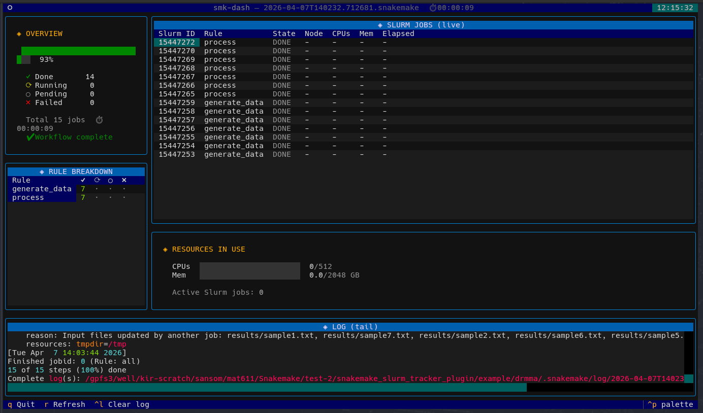
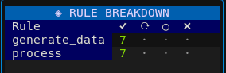

# Live TUI dashboard for Snakemake workflows on Slurm clusters

<p align="center">
    
</p>

```bash
# Demo mode — no Snakemake or Slurm needed, works on a login node
smk-dash demo --speed 4
```
```bash
# Attach to a workflow already running
smk-dash watch --log .snakemake/log/$(ls -t .snakemake/log/ | head -1)
```

```bash
# Wrap a new run
smk-dash run -- snakemake --profile slurm -j 100 --use-envmodules
```

<center>

<br>



</center>
